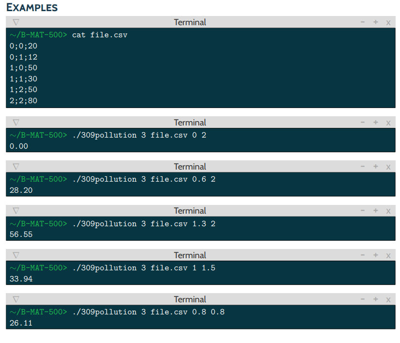

309pollution: Bézier surfaces. Data visualization to find ways to monitor the ambient air in France.
===

Language:   Python

Grade acquired : A || Mark : 19,5 / 20

The project
----
The ambient air quality monitoring in France is ensured by independent associations, members of the ATMO federation, and, on behalf of the State and public authorities, are responsible for implementing means of monitoring.

Why not you? The Lozère market seems easily open for the taking...

So, you decide to start a project based on collaborative initiatives like Citoyens Capteurs in order to acquire data. All that’s left to do is to create a little software for viewing the data...

You receive the data in **triplets (x, y, p)** where *x* and *y* are the coordinates (presumably integers so it’s simpler) on a normal grid and *p* the pollution level (in percentage). We will consider that the pollution is non-existent on the grid’s other points.

Your program will use **Bézier surfaces** to smooth out the data and display the value of the pollution level ina point inside the observed area.

## USAGE:

```
>>
USAGE
    ./309pollution n file x y
DESCRIPTION
    n       number of points on the grid axis
    file    csv file containing the data points x;y;p
    x       abscissa of the point whose pollution level we want to know
    y       ordinate of the point whose pollution level we want to know
```

## Example



